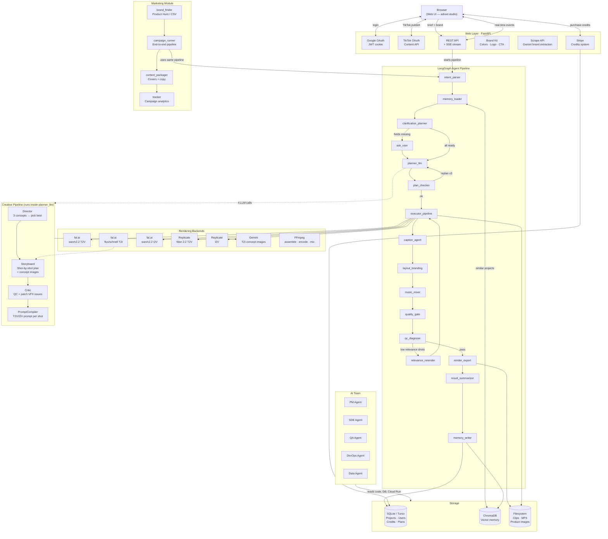

# AdReel — Architecture

> **One-line summary**: Paste a product URL → AI plans a storyboard with concept images → renders each shot via fal.ai / Replicate / Gemini → FFmpeg assembles a 9:16 H.264 MP4 → exports platform-ready copy for TikTok / Instagram / 小红书.

---

## System Overview



---

## Pipeline — Node by Node

| # | Node | What it does |
|---|------|-------------|
| 1 | **intent_parser** | Extracts platform, duration, tone from the raw brief |
| 2 | **memory_loader** | Loads brand kit (SQLite) + retrieves similar past projects (ChromaDB) |
| 3 | **clarification_planner** | Checks if required fields are missing (platform / duration / language) |
| 4 | **ask_user** | Interactively collects missing fields *(skipped if all known)* |
| 5 | **planner_llm** | Runs 4-stage Creative Pipeline → storyboard + concept images + T2V prompts |
| 6 | **plan_checker** | Validates shot count, durations, script completeness; loops back ≤3× |
| 7 | **executor_pipeline** | Renders each shot in parallel (6 workers) via fal.ai or Replicate; falls back to PIL |
| 8 | **caption_agent** | Splits script lines into timed subtitle segments |
| 9 | **layout_branding** | Burns captions + brand logo onto clips via PIL / FFmpeg |
| 10 | **music_mixer** | Selects tone, generates track via Replicate MusicGen, mixes at −18 dB |
| 11 | **quality_gate** | Checks resolution, duration, bitrate; VLM scores each shot's visual relevance |
| 12 | **qc_diagnose** | Root-cause analysis; routes to relevance_rerender / user action / proceed |
| 13 | **relevance_rerender** | Re-renders shots with low relevance scores (up to 2 attempts) |
| 14 | **render_export** | Final FFmpeg encode → 1080×1920 H.264 CRF23 / AAC 128k at 30 fps |
| 15 | **result_summarizer** | Compiles human-readable summary; deducts credits |
| 16 | **memory_writer** | Saves project to SQLite + ChromaDB embedding |
| 17 | **change_classifier** | Classifies feedback as global / local; identifies affected shot indices |
| 18 | **partial_executor** | Re-renders only affected shots; reuses cached clips for unchanged shots |

---

## Creative Pipeline (inside planner_llm)

```
Brief + Brand Kit
       │
       ▼
① Director          — generates 3 creative concepts, picks the strongest
       │               (hook archetypes: pov-immersion / problem-contrast / asmr-reveal / micro-story / social-proof)
       ▼
② Storyboard        — expands concept into shot-by-shot plan
       │               calls Gemini T2I to generate one concept image per shot
       ▼
③ Critic            — reviews plan, patches VFX violations via JSON Patch
       │
       ▼
④ PromptCompiler    — writes one optimized T2V/I2V prompt per shot (positive + negative)
       │
       ▼
   storyboard plan  +  concept_images  +  {shot_id: {positive, negative}} prompts
```

---

## Render Backend Selection

`shot_renderer.py` orchestrates backends:

```
product_image_path set?
    YES → fal.ai T2I (flux/schnell) → fal.ai I2V → final clip
    NO  → fal.ai T2V (wan/v2.2) → final clip
          fallback: Replicate T2V
          fallback: PIL gradient frame
```

For storyboard concept images: always Gemini T2I (not for final render).

---

## Graphs (Multiple Execution Modes)

| Graph | Triggered by | Runs |
|-------|-------------|------|
| **Full pipeline** | `POST /api/projects/{id}/run` | All nodes |
| **Plan only** | `POST /api/projects/{id}/plan` | Stops after plan_checker |
| **Execute only** | `POST /api/projects/{id}/execute` | executor_pipeline → render_export |
| **Partial re-render** | `POST /api/projects/{id}/modify` | change_classifier → affected shots only (or full replan) |
| **Replan** | `POST /api/projects/{id}/feedback` | planner_llm → executor_pipeline → render_export |

---

## External Services

| Service | Role | Fallback |
|---------|------|---------|
| **Anthropic Claude Sonnet 4.6** | Planning, QC, classification | Mock planner |
| **fal.ai** (Wan T2V / I2V, Flux T2I) | Primary video + image generation | Replicate → PIL gradient |
| **Replicate** (Wan T2V / I2V, MusicGen) | Fallback video gen + background music | PIL gradient (video); no music |
| **Gemini** (gemini-2.0-flash) | T2I concept images + brand scraping | Skip concept images |
| **Google OAuth** | User login | Guest mode |
| **Stripe** | Credit purchases | — |
| **TikTok Content API** | Direct video publishing | Manual post |
| **Instagram Graph API** | Post analytics (marketing module) | Skip sync |
| **ChromaDB** | Vector memory (similar projects) | Disabled gracefully |
| **Turso / SQLite** | Project + user + billing data | Local SQLite |
| **FFmpeg** | Video assembly + encode | Required |

---

## Storage Layout

```
$VAH_DATA_DIR/
├── vah.db                     # SQLite: projects, users, credits, plans, brand_kits
├── chroma/                    # ChromaDB vector index
├── projects/
│   └── {project_id}/
│       ├── clips/             # Raw + processed video clips per shot
│       ├── concept_S*.png     # Gemini concept images per shot
│       └── product.png        # Uploaded product reference image (optional)
└── exports/
    └── proj_9x16_*.mp4        # Final output videos (1080×1920, H.264/AAC, 30fps)

marketing/
├── data/marketing.db          # Campaign + post tracking (SQLite)
└── output/{date}/{brand}/
    ├── video.mp4
    ├── cover_tiktok.jpg / cover_instagram.jpg / cover_xiaohongshu.jpg
    └── tiktok.txt / instagram.txt / xiaohongshu.txt
```

---

## Tech Stack

```
Web:        FastAPI  ·  SSE  ·  Vanilla JS (single-page inline HTML)
Agent:      LangGraph  ·  Python 3.11
AI:         Anthropic Claude Sonnet 4.6  ·  LangChain
Video:      fal.ai (T2V/T2I/I2V/transitions)  ·  Replicate (T2V/I2V/MusicGen)  ·  FFmpeg  ·  PIL
Images:     Gemini (concept storyboarding)  ·  fal.ai flux/schnell
Auth:       Google OAuth 2.0  ·  TikTok OAuth  ·  JWT (httponly cookie)
Billing:    Stripe  ·  Credit system
Storage:    SQLite / Turso  ·  ChromaDB  ·  Local filesystem
Deploy:     Google Cloud Run  ·  Cloud Build CI/CD  ·  Custom domain adreel.studio
Marketing:  Product Hunt API  ·  Instagram Graph API  ·  Telegram notifications
AI Team:    Anthropic SDK tool-use loop  ·  5 specialized agents
```
